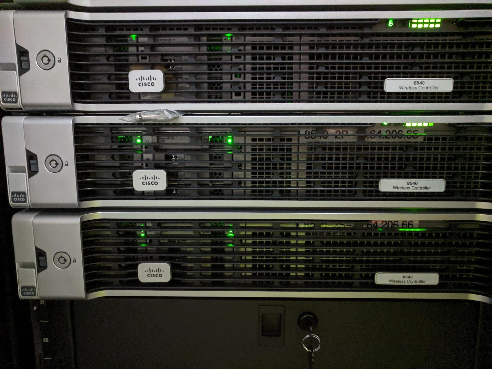

<h1 align="center">
    IP Fabric Licensing
</h1>

Are you trying to automate your network, but a little confused about how licensing works? Are you struggling with complex licensing for devices, users, controllers, APs, or even the air you breathe? Managing these licenses can become a daunting task that requires more tools, programming, and headaches in the end. If complicated documentation is needed to understand licensing, is it worth it? 
The goal is to reduce tools, technical debt, OPeX, CapEx, and complexity while increasing efficiency, simplicity, and revenue. Adding complex licensing models leads to longer deployment times, difficult quoting estimates, and eventually unhappy customers. 

There has to be better solutions. I'm here to tell you, there are... 

At IP Fabric we provide licensing that is easy to understand, implement, and manage. No need to search pages of documentation or establish extra tools to manage your automation solutions. We can break it down for you in a straightforward licensing concept in less than 1 page. 

## Licensing Model
1 physical device = 1 license
1 virtual device = 1 license

Here are some exceptions that will help you understand the saving in time and money your company will experience with IP Fabric licensing. 

### Wireless Controller and APs
Do you have 6000 APs running in 1 controller? 
1 wireless controller + 6000 AP = 1 license

In the image there are 3 wireless controllers managing thousands of APs.

3 controllers + 17,000 APs = 3 licenses

### Firewalls

Do you have a firewall? (VSYS, VDOM, etc.)?
1 virtual instance = 1 license

### Stacked Switches
Do you have a stack switches (Stackwise, etc.)? 
1 switch stack = 1 license

 
In the photo there is a switch stack of 4 switches
4 switch stack = 1 license

In this photo there is a switch stack of 8 switches
8 switch stack = 1 license

### Cloud

Are you in the cloud? 
1 VPC/gateway = 1 License

## Conclusion
As you can see, IP Fabric makes licensing simple and reasonable. No need to build new tools to support the tools that drive digital transformation in your networks. If this excites you go check out more on IP Fabric (https://ipfabric.io/solution/network-automation/). We can help drive transformation in your company get you on the road to your Self-driving network.

